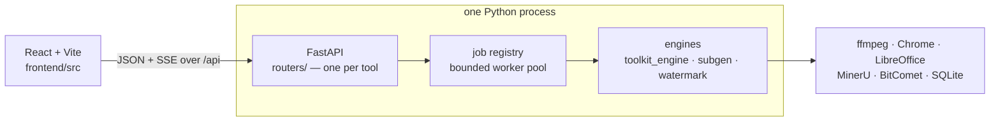
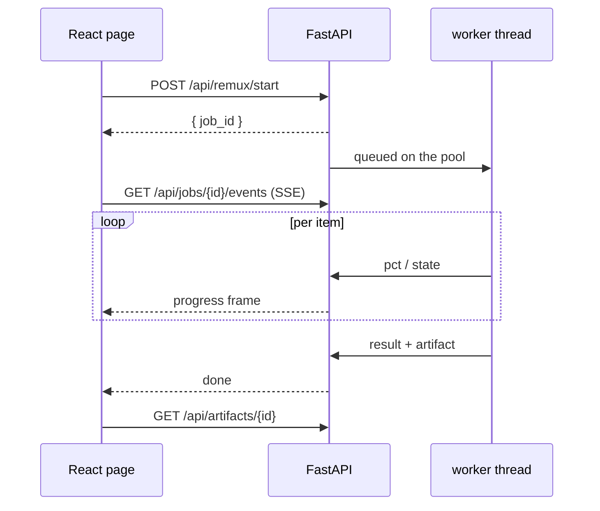
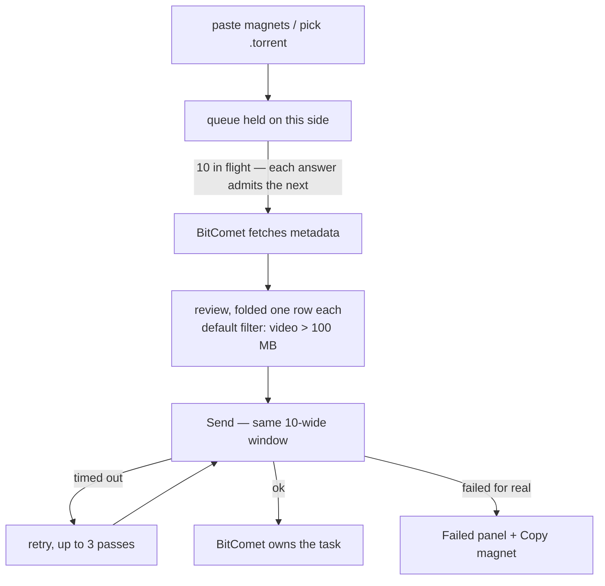
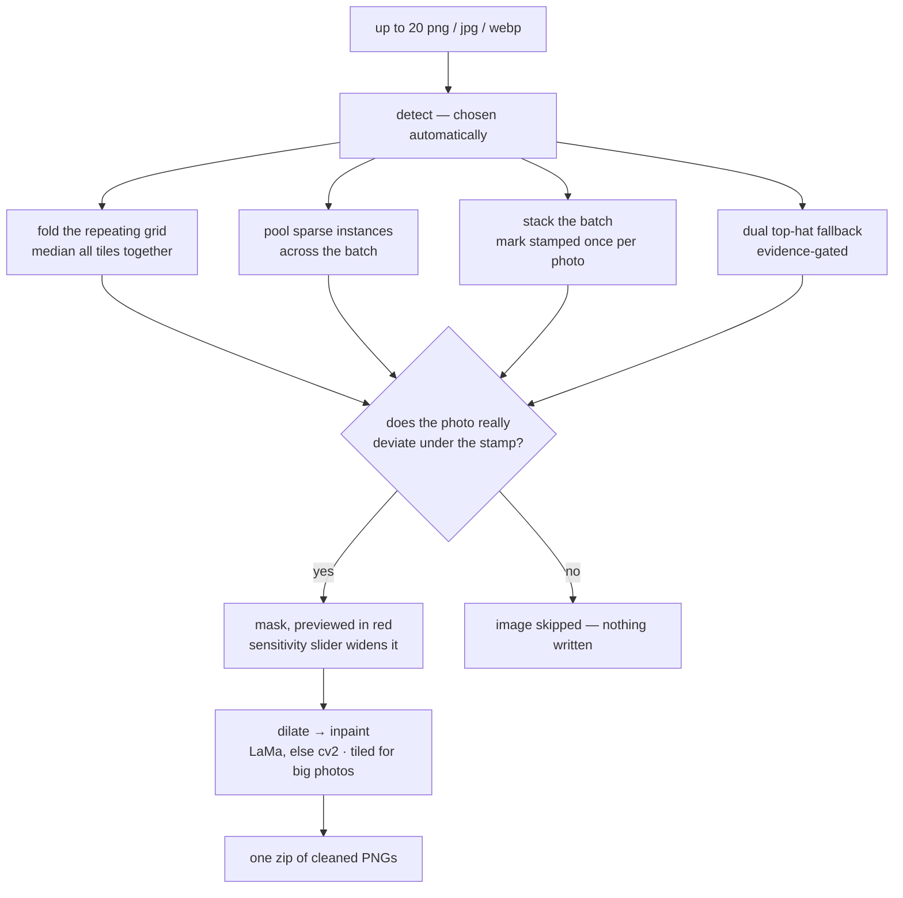

# 🧰 Toolkit

Thirteen small media & file utilities in one local app — a FastAPI backend driving
the engines, a React single-page UI, and one `make` entrance.

> **macOS only.** Folder pickers use AppleScript (`osascript`), and several tools
> drive desktop apps (Chrome, LibreOffice, BitComet) on this Mac.

## Tools

**🎬 Media**

|     | Tool                   | What it does                                                                     |
| --- | ---------------------- | -------------------------------------------------------------------------------- |
| 🧲  | **Magnet Scraper**     | Scrape unwatched video magnets automatically, in bulk, or de-duplicate a list.    |
| 🎬  | **Remux Processor**    | Parallel, lossless remuxing (stream-copy) with configurable tracks.               |
| 🌊  | **Torrent Downloader** | Keep only the files worth keeping, then hand the torrent to BitComet.             |

**🗂️ Files & Tools**

|     | Tool                    | What it does                                                                    |
| --- | ----------------------- | ------------------------------------------------------------------------------- |
| 🌐  | **Web Images to PDF**   | Open a page, scroll to load its images, capture them into one PDF.               |
| 📦  | **File Gatherer**       | Recursively gather files by type and move them into one folder.                  |
| 🖼️  | **Image to PDF**        | Combine selected images (incl. iPhone HEIC) into a single PDF.                   |
| 🧽  | **Watermark Remover**   | Detect watermarks — tiled or once-per-photo — and inpaint them away.             |
| 📄  | **Doc to PDF**          | Accept tracked changes, strip comments, render to PDF via LibreOffice.           |
| 📝  | **Doc to Markdown**     | PDFs / Office docs / images → Markdown with MinerU (text, tables, formulas).     |
| 🧹  | **Cache Purge**         | Recursively find and delete cache / junk files.                                  |
| 📸  | **Photos Library Filter** | Mirror a Photos library without its caches, safe while Photos is running.     |
| 📦  | **Dependency Upgrader** | Scan a project's `pyproject.toml` / `package.json`, upgrade and commit each one. |

**🌐 Network**

|     | Tool                          | What it does                                                          |
| --- | ----------------------------- | --------------------------------------------------------------------- |
| 🛰️  | **Optimized-IP Subscription** | Rewrite nodes with optimized Cloudflare IPs, serve LAN subscriptions.  |

## Quick start

```bash
make install     # backend deps (uv) + frontend deps (npm)
make dev         # → http://localhost:5173
```

| Command      | What runs                                | Reachable from            |
| ------------ | ---------------------------------------- | ------------------------- |
| `make dev`   | Vite `:5173` + API `:8000`, hot-reload   | this Mac                  |
| `make start` | built UI + API in one process, `:8000`   | this Mac (loopback)       |
| `make host`  | the same, bound to `0.0.0.0`             | every device on the Wi-Fi |

One Ctrl-C stops everything. In dev, Vite proxies `/api` to the backend, so the UI
calls same-origin and streaming needs no CORS. `make host PORT=9000` moves the base
port (auto-advances if busy); `HOST=127.0.0.1 make host` keeps it local.

> ⚠️ **`make host` has no authentication**, and these tools move and permanently
> delete files on this Mac. It's plain HTTP — run it only on a network you trust.

## How it works



| Path                            | Role                                                                    |
| ------------------------------- | ----------------------------------------------------------------------- |
| `backend/src/toolkit_engine/`   | Framework-free domain logic: ffmpeg, docx, scanning, scraping, PDFs.    |
| `backend/src/subgen/`           | Subscription engine — parse / rewrite / render / SQLite.                |
| `backend/src/watermark/`        | Watermark detection and inpainting.                                     |
| `backend/src/toolkit_api/`      | App factory, `deps.py`, `schemas.py`, `routers/`, the job registry.     |
| `frontend/src/`                 | `api.ts` (one HTTP + SSE wrapper) and the React pages.                  |

Anything long-running — remux, conversions, scans, deletions — is a **job**:



Jobs are tracked app-wide, not per page: every open tool keeps a tab in the bottom
dock with its running jobs, so switching tools — or reloading — never loses a run.

## Configuration

Environment variables, or `backend/.env` (copy `backend/.env.example`). All optional.

| Variable                 | Default               | What it does                                                     |
| ------------------------ | --------------------- | ---------------------------------------------------------------- |
| `WEBSITE_URL`            | empty                 | Magnet Scraper: base URL walked by Automatic mode                |
| `CUTOFF_VIDEO`           | empty                 | Magnet Scraper: stopping anchor, auto-advanced after each run    |
| `SUB_DB_PATH`            | `backend/data/sub.db` | Subscription: SQLite database path                               |
| `SUB_ACCESS_TOKEN`       | empty                 | Require `?token=…` on subscription links                         |
| `SUB_PUBLIC_HOST`        | `.local` name         | Host used in subscription links, then a LAN IP                   |
| `WATERMARK_DEVICE`       | auto                  | Pin LaMa to `cpu` / `mps` / `cuda`                               |
| `WATERMARK_LAMA_MODEL`   | empty                 | Path to a pre-downloaded `big-lama.pt` (skips the download)      |
| `APP_CORS_ORIGINS`       | Vite dev origins      | CORS allowlist (cross-origin API calls only)                     |
| `APP_STATIC_DIR`         | `../frontend/dist`    | Built UI served by the single-server modes                       |
| `TOOLKIT_DISABLED_TOOLS` | empty                 | Slugs to switch off — hidden **and** unmounted (404). Read at startup |
| `HOST` / `PORT`          | `0.0.0.0` / `8000`    | `make host` bind / base port (shell env, not `.env`)             |

## Requirements

| Needed by             | Requirement                                            | Notes                                                             |
| --------------------- | ------------------------------------------------------ | ----------------------------------------------------------------- |
| everything            | [uv](https://docs.astral.sh/uv/)                       | Python 3.14, managed via `.python-version`                        |
| everything            | [Node.js](https://nodejs.org/) ≥ 20                    | frontend build                                                    |
| Remux Processor       | [FFmpeg](https://ffmpeg.org/)                          | `brew install ffmpeg`                                             |
| Torrent Downloader    | [BitComet](https://www.bitcomet.com/)                  | *Options → Remote Access*: enable **both** switches, set user/pass |
| Watermark Remover     | [torch](https://pytorch.org/)                          | via the `watermark` extra; big-lama (~200 MB) auto-downloads. Falls back to cv2 |
| Web Images to PDF     | [Google Chrome](https://www.google.com/chrome/)        | matching driver downloaded automatically                          |
| Doc to PDF            | [LibreOffice](https://www.libreoffice.org/)            | `brew install --cask libreoffice`                                 |
| Doc to Markdown       | [MinerU](https://github.com/opendatalab/MinerU)        | installed with the backend; models download on first run          |

For BitComet on *this* Mac the app reads credentials from BitComet's own config —
nothing to configure twice.

## Development

```bash
make test        # backend pytest + ruff, then frontend typecheck + eslint + vitest + build
make build       # frontend/dist only
make clean       # remove build artifacts
```

From `backend/`: `uv run pytest` is the single backend test command, and
`uv run ruff check src tests` the lint.

## Tool notes

<details>
<summary><b>🧲 Magnet Scraper</b> — three modes</summary>

| Mode                  | What it does                                                                      |
| --------------------- | --------------------------------------------------------------------------------- |
| **Automatic**         | Walks `WEBSITE_URL` page by page until it reaches `CUTOFF_VIDEO`, scrapes everything newer, then advances the cutoff. |
| **Manual**            | Paste video page URLs, get their magnets.                                          |
| **Remove Duplicated** | Paste raw magnets, get the unique set back.                                        |

</details>

<details>
<summary><b>🎬 Remux Processor</b></summary>

Pick a source folder and videos, set video / audio / subtitle track indices and the
subtitle language tag, optionally attach external subtitles (matched by filename
stem), choose an output folder and worker count. Live per-file progress, then a
success/failure summary. No re-encoding.

</details>

<details>
<summary><b>🌊 Torrent Downloader</b> — a dispatcher, not a download manager</summary>



- Every file is reviewed **before any content downloads**. Tick a row to override
  the filter. The minimum size applies to video and audio only — a global floor
  would discard every ~40 KB subtitle.
- Windowing exists because a magnet must be staged *running* to learn its file
  list: an unwindowed paste of thirty would put thirty swarm fetches on BitComet in
  one click. A client that starts grinding simply stops being fed.
- Retries are safe because a send is idempotent — during a batch BitComet's API can
  answer so slowly that a send reads as failed when the task actually landed.
- Once sent, the task is BitComet's: pause, watch and remove it there. Nothing is
  stored here to drift out of date. *Discard* only cancels a staging you never sent.
- **Pick the destination folder before you resolve** — BitComet fixes a task's save
  folder at creation and cannot move it after.

**Another machine's BitComet.** *Change device* → its address (`192.168.1.50:19377`,
or just the host; port 19377 assumed) + the Web UI credentials **it** uses → *Test
connection*. Remembered across restarts. Two differences, both because its disk is
not this one: *Save to* offers that machine's registered folders instead of Browse,
and `~/…` is refused rather than expanded to this Mac's home.

Devices live in `backend/data/torrents.db` (mode `0600`). Remote passwords are
stored in plaintext because BitComet's login needs the password itself, not a digest
— the same exposure as `BitComet.xml`, which holds the local one in plaintext too.

</details>

<details>
<summary><b>🧽 Watermark Remover</b> — the mark repeats, or the batch proves it</summary>



- **You see every mask before anything changes.** There is no brush: the
  detector masks what it actually proved, or reports that it proved nothing and
  the image is skipped — a mask hand-drawn over a watermark detection could not
  find is a mask over whatever the person could see, and inpainting that
  damaged photographs while leaving the watermark in place.
- **A one-off mark is proven by the batch, not painted.** A mark that never
  repeats has no copies to fold within its own frame — but a supplier stamps
  the same mark at the same place on every photo, so the batch stacks its
  frames' detail fields and keeps what they all deviate on together
  (`backend/src/watermark/stacked.py`). Every constant is measured: 70/75
  synthetic marked batches detected with 0/286 false fires. It needs company —
  three frames minimum, and a lone image with a one-off mark is skipped, not
  guessed at — and it refuses a batch of near-identical shots, where
  "everything agrees" describes the scene rather than a mark. The run's
  destruction guard (`would_destroy_content` in
  `backend/src/watermark/pipeline.py`) still vetoes any mask that would take
  the picture with it.
- Folding recovers the mark itself rather than judging pixels — the overlay is
  identical in every tile, so it survives the median while the photograph cancels
  out. That makes a mark far too faint to see anywhere on its own legible.
- Folding alone is **not** evidence: a clean photo can lock onto its own sky
  gradient. Verifying each stamp against the image is what separates them, and it
  is why a mark buried in busy texture is skipped rather than guessed at. Evidence
  and the gates that were tried and rejected are in `backend/src/watermark/pattern.py`.
- Marks are shared across the batch — one watermarking tool usually ran over all of
  them — so an image that cannot recover its own is masked from a sibling's.
- Only marked pixels are ever written, always as PNG (re-encoding inpainted pixels
  as JPEG would stamp fresh artifacts right where the fill happened). LaMa picks
  CUDA → MPS → CPU; on an M-series Mac MPS is ~8× faster for output differing by at
  most one grey level.

Headless over a folder, no web app involved — it shares marks across the folder the
same way, and prints what it skipped:

```bash
cd backend && uv run python -m watermark clean IN_DIR OUT_DIR --inpainter lama
```

> For images you own or are licensed to edit — removing someone else's watermark
> from content you have no rights to is not what this is for.

</details>

<details>
<summary><b>🧹 Cache Purge</b> and <b>📦 File Gatherer</b></summary>

**Cache Purge** — edit the globs (defaults `*.dwl`, `*.dwl2`, `*.bak`, `*.log`,
`*.db`, `*.tmp`, `*.err`; catch-all patterns are refused), **Scan** to preview every
match with its total size, then **Delete** behind an explicit confirmation. Deletion
is permanent — the preview is the safety net.

**File Gatherer** — pick source and target, choose categories (Video, Audio, Image,
Subtitle, Document, Archive) and/or custom globs, then **Scan & Move** in one click.
Duplicates are auto-numbered (`name_1.ext`); you get a moved/failed summary.

</details>

<details>
<summary><b>📸 Photos Library Filter</b> — a cache-free mirror Photos can still open</summary>

Point it at the live library and a `*.photoslibrary` destination outside it,
**Dry run** to see the plan, then untick the dry run and **Mirror library**.
Re-running only copies what changed. What a run does, in order:

1. **plan** — walk the source and classify every file with the rules (below).
   Every directory is mirrored; an excluded one stays as an empty skeleton, so
   the bundle keeps its shape.
2. **snapshot** — any file with a `<name>-wal` sibling is a live WAL-mode SQLite
   database (`database/Photos.sqlite`, the analysis databases). It is written
   with `VACUUM INTO` from a read-only connection, so the copy is complete even
   while Photos is writing; `-wal` / `-shm` files are never copied.
3. **copy** — `copyfile(3)` with `COPYFILE_CLONE`: an APFS clone (instant, no
   extra space on the same volume) that keeps mtime and the
   `com.apple.assetsd.*` extended attributes Photos stores on originals. An
   unchanged file is skipped; a favourite flag Photos changed without touching
   mtime is still picked up.
4. **delete** — anything in the destination that is not in the plan is removed.
   The destination must end in `.photoslibrary` and must not overlap the source.
5. **verify** — the mirrored `Photos.sqlite` is opened read-only and every
   asset's original, and every edited asset's `resources/renders/<X>/<UUID>.plist`
   edit recipe, is checked for. Problems are listed in the report.

Rules are rsync-style, one per line; everything not matched is kept:

```
# unanchored: matches at any depth
.DS_Store
# trailing slash: a directory and everything inside it
database/search/
# * and ? stay inside one path component
database/*.lock
# ** crosses components
private/**/caches/
# leading slash: anchored to the library root
/top-level-only.txt
```

Never exclude `resources/renders/`: it is not a cache but the edit recipes and
rendered edits the database marks as present. `resources/derivatives/`
(thumbnails and previews) is a real cache; if thumbnails show blank after
restoring a mirror, hold Option+Command while opening Photos and choose Repair
Library. Nothing is ever written into the source library.

</details>

<details>
<summary><b>🛰️ Optimized-IP Subscription</b></summary>

Batch-replace the server in your self-built `vmess` / `vless` / `trojan` nodes with
optimized Cloudflare IPs, then serve subscriptions for Shadowrocket / Clash / Surge.
Everything stays in `backend/data/sub.db`; nothing leaves the machine.

- Paste nodes plus `host[:port][#remark]` addresses — base64 subscriptions
  auto-expand, duplicates are dropped.
- One click yields Raw / Clash / Surge output, a link (`/sub/{id}?target=…`) and a
  QR code a phone on the same Wi-Fi can import — run `make host` so it can reach it.
- Identical inputs reuse the same short link (deduplicated by content hash); history
  is listed to reload or delete.

</details>

<details>
<summary><b>📄 Doc to PDF</b>, <b>📝 Doc to Markdown</b>, <b>🌐 Web Images to PDF</b>, <b>🖼️ Image to PDF</b></summary>

- **Doc to PDF** — upload `.docx`; tracked changes are accepted and comments removed
  at the XML level, then LibreOffice renders the PDFs into one zip. No Word needed.
- **Doc to Markdown** — `pdf`, `png`, `jpg`, `docx`, `pptx`, `xlsx`; each is parsed
  in a subprocess with live batch progress, and Markdown + `images/` + JSON sidecars
  come back as one zip. Advanced options pick the backend (`hybrid-engine` default,
  `pipeline`, `vlm-engine`), parse method, OCR language, effort, formula/table
  toggles. MinerU's models download on first run, so the first conversion is slower.
- **Web Images to PDF** — enter a URL, **Open in browser** (a real Chrome window
  opens on this Mac), scroll until every image has loaded, then **Capture & build
  PDF**. A bookmarked table of contents is added when the page exposes one.
- **Image to PDF** — `png` / `jpg` / `jpeg` / `heic`, ordered by filename.

</details>

## License

Copyright (c) 2026 Waining Ceoi. Licensed under the
[GNU General Public License v3.0 or later](LICENSE) — derivative works you
distribute must also be released under the GPL.
